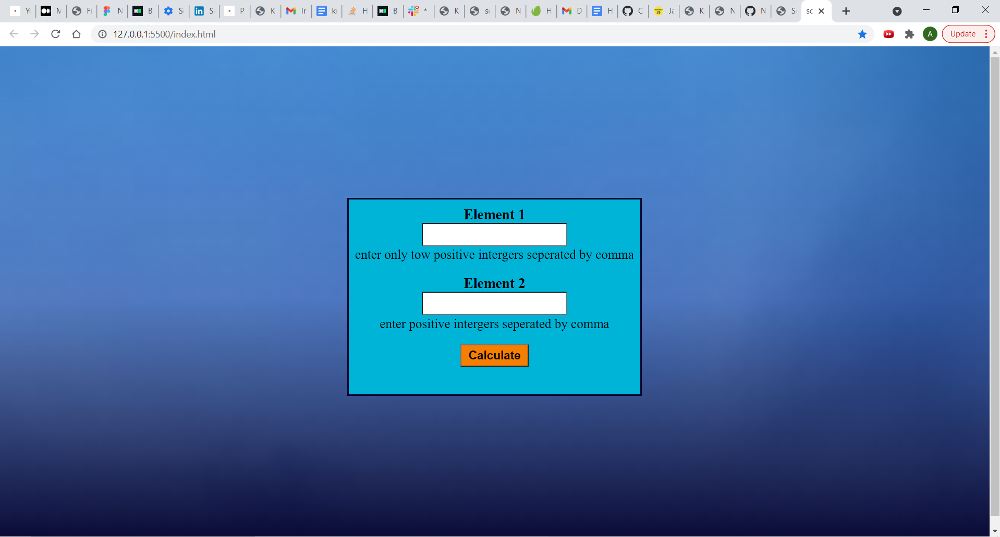

# Scale Balancing project

this project is all about balancing the weight of 2 elemens with different values.

## App

### Built With

- HTML
- CSS
- JS

### Prerequisites

Knowledge about:

- HTML
- CSS
- Google chrome
- JS

## Clone project

- To get a local copy up, and running follow these simple example steps.
- Clone this repository with `https://github.com/kivenalaric/scalebalance-app.git` using your terminal.
- Change to the project directory by entering: cd scale in the terminal.

## steps

- $ git clone `github.com/kivenalaric/scalebalance-app.git`
- $ `cd Rebaseproj`
- $ `cd scale`
- $ `git checkout feature/scale-app`

## Start App

- run by opening the index.html in the browser

## Author

👤 **KivenAlaric**

- GitHub: [@kivenalaric](https://github.com/kivenalaric/scalebalance-app)

## 📝 License

This project is [Rebase Academy](./LICENSE) licensed.
